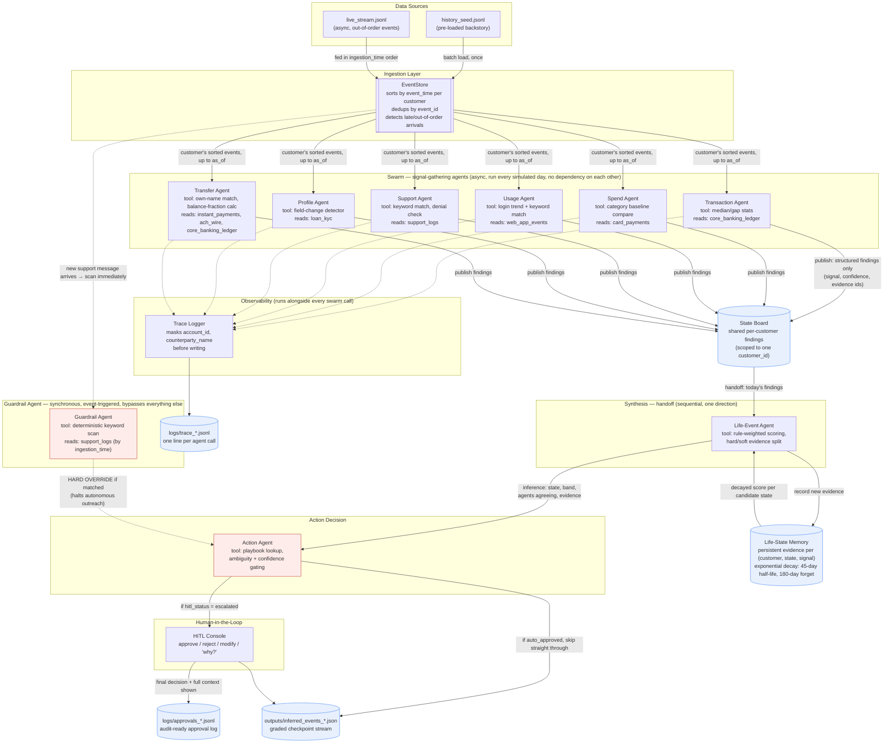

# System Architecture — Agentic Customer 360

This diagram is Mermaid source. GitHub renders `.md` files with a
` ```mermaid ` fence natively — no extra tool needed once this file is in
your repo. It also pastes directly into https://mermaid.live or Draw.io
(Arrange > Insert > Advanced > Mermaid) if you want to export a PNG for
the solution document.

**How to read it:**
- **Solid arrows** = the daily batch loop (asynchronous — runs once per
  simulated day, regardless of which specific event triggered it).
- **Dashed arrows** = synchronous, event-triggered flows that fire the
  moment a specific event arrives, bypassing the daily loop. The
  guardrail is the only synchronous path in this system, matching the
  Production Bar's requirement that catastrophic actions be checked
  immediately, not on the next scheduled pass.
- **Cylinders** = persistent stores (memory / logs / output files).
- **Rectangles** = agents / active components.



## Component summary (for cross-checking against the Production Bar checklist)

| Component | Type | Data source(s) | Output |
|---|---|---|---|
| EventStore | Ingestion | `history_seed.jsonl`, `live_stream.jsonl` | Per-customer sorted event list |
| Transaction Agent | Swarm (async) | `core_banking_ledger` | `income_drop`, `income_stopped`, `recurring_started:*`, `recurring_stopped:*` |
| Spend Agent | Swarm (async) | `card_payments` | `spend_spike:*`, `spend_drop:*`, `card_activity_drop` |
| Usage Agent | Swarm (async) | `web_app_events` | `login_drop`, `login_spike`, `search_theme:*`, `feature_theme:*` |
| Support Agent | Swarm (async) | `support_logs` | `support_theme:*`, `support_denied` |
| Profile Agent | Swarm (async) | `loan_kyc` | `profile_change:*` |
| Transfer Agent | Swarm (async) | `instant_payments`, `ach_wire`, `core_banking_ledger` | `external_self_transfer`, `income_swept_out` |
| State Board | Shared memory | Swarm agent outputs | Today's findings, per customer |
| Life-Event Agent | Synthesis (handoff) | State Board | Inferred state, confidence band, evidence |
| Life-State Memory | Persistent memory | Life-Event Agent | Decayed, accumulated evidence scores |
| Guardrail Agent | Synchronous, event-triggered | `support_logs` (by `ingestion_time`) | Hard override (bypasses inference) |
| Action Agent | Decision | Life-Event inference + Guardrail hits | Proposed action, subtype, `hitl_status` |
| HITL Console | Human checkpoint | Action Agent's proposal | Final decision + approval log entry |
| Trace Logger | Observability | Every swarm agent call | Masked, timestamped trace log |

## Why this topology (brief justification, for the solution document)

- **Swarm** for the six signal agents: they read disjoint slices of the
  event stream and have no dependency on each other's output, which is
  exactly where the swarm pattern's parallelism wins and its main
  weakness (unresolved disagreement) is deferred, on purpose, to synthesis.
- **Handoff** from the swarm into the Life-Event Agent: a single,
  one-directional pass with a clearly scoped package (structured
  findings, not raw reasoning traces).
- **Guardrail kept fully outside the daily batch loop**, checked
  synchronously against `ingestion_time` the moment a message arrives.
  This is the one place the system needs to react in real time rather
  than wait for the next scheduled pass — matching the Production Bar's
  distinction between synchronous flows (authorization-time checks) and
  asynchronous ones (everything else).
- **HITL as a gate, not a pipeline stage:** it only activates when the
  Action Agent's `hitl_status` is `escalated`, so low-stakes `no_action`
  and `auto_approved` decisions flow straight through without blocking on
  a human every single day.
